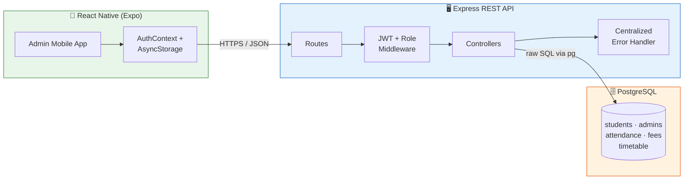

<div align="center">

# 🎓 SVCE ERP

### Full-Stack College Management System

**Real auth. Real relational schema. Real bulk operations. Not a mocked prototype.**

[](https://expo.dev)
[](https://nodejs.org)
[](https://www.postgresql.org)
[](https://jwt.io)
[](LICENSE)

[Screenshots](#-screenshots) · [Getting Started](#-getting-started) · [API Reference](#-api-overview) · [Report Bug](../../issues)

</div>

---

## 📖 Overview

**SVCE ERP** is a React Native (Expo) admin app backed by a Node.js/Express REST API and PostgreSQL, built for **Sri Venkateshwara College of Engineering**. It handles the actual day-to-day work of a registrar's office: registering students, searching records, bulk-admitting students via CSV, and transferring students between departments — all behind real JWT-authenticated, role-based APIs.

### Why this project

Most student CRUD demos stop at "form submits to a database." This one goes further:

- 🔐 **Real auth**, not a bypass — JWT-based admin login, bcrypt-hashed passwords, protected routes with role middleware
- 🗄️ **Real relational schema** — foreign keys, `CHECK` constraints, a generated column (`due_amount`), auto-updating `updated_at` triggers
- 📊 **Bulk operations** — CSV parsing and row-level validation for admitting dozens of students at once, with per-row success/failure reporting
- 🌐 **Cross-platform networking handled properly** — a shared, platform-aware API config instead of a hardcoded `localhost` that silently breaks on Android emulators

---

## ✨ Features

### Admin App (React Native / Expo)
- JWT-based admin login with persistent sessions (AsyncStorage) and clean logout
- **Student Registry** — live list pulled from PostgreSQL, filterable by status
- **Add Student** — full registration form (Library ID issued at admission; USN assigned later in the workflow, matching real institutional process)
- **Search Student** — real-time search across name, USN, and Library ID against live backend data
- **Bulk Student Admission** — CSV file picker, client-side validation, then bulk import via the API with a per-row success/failure summary
- **Transfer Student** — look up a student by Library ID and move them between departments
- Dashboard, Export, and Settings screens

### Backend API (Node.js / Express / PostgreSQL)
- Dual authentication: **students** (Library ID + password) and **admins** (email + password)
- Role-based route protection (`requireAdmin` / `requireStudent` middleware)
- Student self-service endpoints: profile, attendance (with per-subject % summary), fees, timetable
- Admin management endpoints: create/list/update students, mark attendance, manage fees, manage timetable
- Centralized error handling that translates PostgreSQL error codes (unique/foreign-key/check violations) into clean JSON responses
- Request validation on every write endpoint

---

## 📱 Screenshots

| Login | Dashboard | Student Registry | Add Student |
| ----- | --------- | ----------------- | ------------ |
|  |  |  |  |

| Bulk Import | Transfer Student | Export Student Records |
| ------------ | ------------------ | ------------------------ |
|  |  |  |

---

## 🏗️ Architecture



---

## 🛠️ Tech Stack

| Layer | Technology |
|---|---|
| Mobile App | React Native (Expo SDK 51) |
| Navigation | React Navigation (Drawer + Bottom Tabs + Native Stack) |
| Auth State | React Context (`AuthContext`) + AsyncStorage |
| File Import | `expo-document-picker` + `expo-file-system` |
| Backend | Node.js + Express.js |
| Database | PostgreSQL (raw `pg`, no ORM) |
| Auth | JSON Web Tokens (`jsonwebtoken`) + `bcrypt` |
| Config | `dotenv`, `cors` |

---

## 📂 Project Structure

```
svce-erp/
├── frontend/                      # React Native (Expo) app
│   ├── App.js
│   ├── app.json
│   ├── package.json
│   └── src/
│       ├── api/                    # authApi.js, studentsApi.js (fetch + JWT)
│       ├── components/             # Header, StudentCard, StatusBadge, SidebarDrawerContent
│       ├── config/                 # apiConfig.js — platform-aware API base URL
│       ├── context/                # AuthContext.js — single source of truth for auth state
│       ├── data/                   # mockStudents.js (legacy fixtures, no longer used)
│       ├── navigation/             # RootNavigator, AuthNavigator, BottomTabs, StudentRegistryStack
│       ├── screens/                # Dashboard, StudentRegistry, AddStudent, StudentDetail,
│       │                           # SearchStudent, ImportStudents, TransferStudent, Settings,
│       │                           # AdminLogin, Tasks, ExportStudentData
│       ├── theme/                  # colors.js, typography.js
│       └── utils/                  # authStorage.js (AsyncStorage), mapStudent.js
│
└── backend/                       # Node.js / Express / PostgreSQL API
    ├── server.js
    ├── package.json
    ├── .env.example
    ├── config/db.js                # PostgreSQL connection pool
    ├── middleware/                 # auth.js (JWT + roles), errorHandler.js
    ├── controllers/                # authController, studentController, adminController
    ├── routes/                     # authRoutes, studentRoutes, adminRoutes
    ├── models/                     # Student, Admin, Attendance, Fee, Timetable
    ├── utils/                      # generateToken, asyncHandler, validators
    └── database/
        ├── schema.sql              # Full DDL: tables, constraints, triggers
        └── seed.sql                # 5 students, 2 admins, attendance, fees, timetable
```

---

## 🚀 Getting Started

### Prerequisites
- Node.js v18+
- PostgreSQL v13+
- Expo CLI (`npx expo`) and either Android Studio (emulator) or the Expo Go app on a physical device

### 1. Backend Setup

```bash
cd backend
npm install
cp .env.example .env   # fill in your DB password + a real JWT_SECRET

# Create the database
psql -U postgres -c "CREATE DATABASE svce_erp;"

# Apply schema + seed data
psql -U postgres -d svce_erp -f database/schema.sql
psql -U postgres -d svce_erp -f database/seed.sql

# Start the API
npm start
```

Verify it's running:
```bash
curl http://localhost:5000/api/health
```

Seed admin login: `admin@svce.edu.in` / `Admin@123`

### 2. Frontend Setup

```bash
cd frontend
npm install
npx expo start -c
```

**Android emulator networking note:** the emulator can't reach your machine via `localhost` out of the box. This project uses an `adb reverse` tunnel instead of the usual `10.0.2.2` alias (more reliable across AVD versions):

```bash
adb reverse tcp:5000 tcp:5000
```

Run this once per emulator session (it resets on emulator restart), then open the app and log in.

*(Physical device via Expo Go: update `HOST` in `src/config/apiConfig.js` to your machine's LAN IP instead.)*

---

## 🔌 API Overview

**Auth**
| Method | Endpoint | Description |
|---|---|---|
| POST | `/api/auth/student/login` | Student login (Library ID + password) |
| POST | `/api/auth/admin/login` | Admin login (email + password) |

**Student** *(requires student JWT)*
| Method | Endpoint | Description |
|---|---|---|
| GET | `/api/student/profile` | Own profile |
| GET | `/api/student/attendance` | Attendance + per-subject % summary |
| GET | `/api/student/fees` | Fee records, all semesters |
| GET | `/api/student/timetable` | Weekly class timetable |

**Admin** *(requires admin JWT)*
| Method | Endpoint | Description |
|---|---|---|
| POST | `/api/admin/students` | Register a student |
| GET | `/api/admin/students` | List/filter students |
| GET | `/api/admin/students/:id` | Get one student |
| PUT | `/api/admin/students/:id` | Update a student (e.g. department transfer) |
| POST | `/api/admin/attendance` | Mark attendance |
| PUT | `/api/admin/attendance/:id` | Update attendance |
| POST | `/api/admin/fees` | Create a fee record |
| PUT | `/api/admin/fees/:id` | Update a fee record |
| POST | `/api/admin/timetable` | Add a timetable entry |
| PUT | `/api/admin/timetable/:id` | Update a timetable entry |

Full request/response examples are in [`backend/README.md`](./backend/README.md).

---

## 🗄️ Database Schema

Five relational tables — `admins`, `students`, `attendance`, `fees`, `timetable` — with foreign keys, `CHECK` constraints, and a `fees.due_amount` **generated column** (`total_amount - paid_amount`). See [`backend/database/schema.sql`](./backend/database/schema.sql) for the full DDL.

---

## 📄 License

MIT — free to use, fork, and adapt for learning or portfolio purposes.

---

<div align="center">

Built by **Sania Sagheer**

</div>
