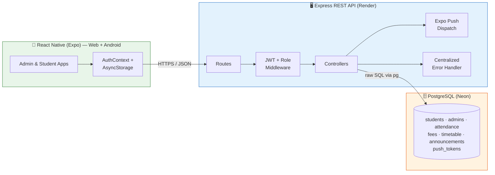

<div align="center">

# 🎓 SVCE ERP

### Full-Stack College Management System

**Real auth. Real relational schema. Real bulk operations. Deployed, not just demoed.**

[](https://expo.dev)
[](https://nodejs.org)
[](https://www.postgresql.org)
[](https://jwt.io)
[](https://education-erp-pi.vercel.app/)
[](https://expo.dev/accounts/saniassagheer/projects/svce-erp)
[](LICENSE)

**[🌐 Live Web App](https://education-erp-pi.vercel.app/)** · **[📱 Android Build](https://expo.dev/accounts/saniassagheer/projects/svce-erp/builds/5e344cef-e048-447d-ad75-53b501dd5df6)** · [Getting Started](#-getting-started) · [API Reference](#-api-overview) · [Deployment](#️-deployment)

</div>

---

## 📖 Overview

**SVCE ERP** is a full-stack academic management system built for **Sri Venkateshwara College of Engineering** — a React Native (Expo) app with two portals (Admin and Student), backed by a Node.js/Express REST API and a real relational PostgreSQL schema. It runs on **web (Vercel)**, **Android (EAS Build)**, and in Expo Go for local development, all from one codebase.

### Why this project

Most student CRUD demos stop at "form submits to a database." This one goes further:

- 🔐 **Real auth** — JWT sessions for both Admin and Student portals, bcrypt-hashed passwords, role-protected routes, a centralized JWT config shared identically between token signing and verification
- 🗄️ **Real relational schema** — foreign keys, `CHECK` constraints, a generated column (`fees.due_amount`), auto-updating `updated_at` triggers
- 📊 **Bulk operations** — CSV import with per-row validation and a success/failure summary, plus CSV/PDF export generated from live data
- 📈 **Live analytics, not mock numbers** — the dashboard's every statistic is a real aggregate query against PostgreSQL
- 🔔 **Push notifications** — announcements posted by an admin are pushed to student devices via the Expo Push API
- 🌐 **Deployed on three targets** — a static web build on Vercel, an installable Android APK/AAB via EAS Build, and a hosted API + database (Render + Neon)

---

## ✨ Features

### Admin Portal
- JWT login with persistent sessions and clean logout (Android/iOS + web)
- **Dashboard** — live totals (students, active/suspended, attendance %, fee collection) pulled straight from PostgreSQL via `/api/admin/stats`
- **Student Registry** — searchable/sortable live directory with real Active/Suspended counts
- **Add / Search / Transfer Student**, **Bulk CSV Import** with per-row validation
- **Mark Attendance** (bulk, transactional) + **Low Attendance** flag list
- **Fee Management** + **Fee Defaulters** view with outstanding-balance totals and shareable PDF receipts
- **Timetable Management** — add/edit periods per department, semester, and section
- **Announcements** — post a notice; it's pushed to every registered student device
- **Export Student Data** — real, filtered CSV/PDF generated on-device from live records
- **Settings** — account info, notification toggle, change password (bcrypt-verified), institution details, help & support

### Student Portal
- Library ID + password login, isolated from the admin session
- Home, per-subject **Attendance** %, **Fees** (with downloadable receipts), weekly **Timetable**, **Notices** (announcements), and **Profile**

### Backend API (Node.js / Express / PostgreSQL)
- Dual authentication (student + admin) with role-based middleware (`requireAdmin` / `requireStudent`)
- Centralized JWT config (`config/jwt.js`) — signing and verification always read the same secret/expiry, eliminating drift between the two
- Aggregate reporting endpoints (`/api/admin/stats`, `/api/admin/fees/defaulters`)
- Push notification dispatch via the Expo Push API, with automatic pruning of dead device tokens
- Centralized error handling that translates PostgreSQL error codes into clean JSON responses
- `DATABASE_URL` support for hosted Postgres (Neon/Render/Supabase) with SSL, alongside local `DB_*` config

---

## 🏗️ Architecture


```mermaid
flowchart LR
    subgraph Client["📱 React Native (Expo) — Web + Android"]
        UI[Admin & Student Apps]
        Ctx[AuthContext +<br/>AsyncStorage]
        UI --> Ctx
    end

    Ctx -- HTTPS / JSON --> API

    subgraph Backend["🖥️ Express REST API (Render)"]
        API[Routes] --> MW[JWT + Role<br/>Middleware]
        MW --> Ctrl[Controllers]
        Ctrl --> Push[Expo Push<br/>Dispatch]
        Ctrl --> Err[Centralized<br/>Error Handler]
    end

    Ctrl -- raw SQL via pg --> DB

    subgraph Database["🗄️ PostgreSQL (Neon)"]
        DB[(students · admins · attendance<br/>fees · timetable · announcements<br/>push_tokens)]
    end

    style Client fill:#e8f5e9,stroke:#2e7d32
    style Backend fill:#e3f2fd,stroke:#1565c0
    style Database fill:#fff3e0,stroke:#e65100
```

---

## 🛠️ Tech Stack

| Layer | Technology |
|---|---|
| App | React Native (Expo SDK 51) — runs on Web, Android, and Expo Go |
| Navigation | React Navigation (Drawer + Bottom Tabs + Native Stack) |
| Auth State | React Context (`AuthContext`) + AsyncStorage |
| Charts/Export | `expo-print`, `expo-sharing`, `expo-file-system` |
| Push | `expo-notifications` + Expo Push API |
| Backend | Node.js + Express.js |
| Database | PostgreSQL (raw `pg`, no ORM) — hosted on **Neon** |
| Auth | JSON Web Tokens (`jsonwebtoken`) + `bcrypt` |
| Web Hosting | **Vercel** (static export, SPA rewrites) |
| API Hosting | **Render** |
| Android Builds | **EAS Build** (APK preview / AAB production) |

---

## 📂 Project Structure

```
svce-erp/
├── App.js
├── app.json
├── eas.json                        # EAS Build profiles (development/preview/production)
├── vercel.json                     # Vercel static-export + SPA rewrite config
├── package.json
└── src/
    ├── api/                        # apiClient.js, studentsApi.js, statsApi.js, announcementsApi.js...
    ├── components/                 # Header, StudentCard, SidebarDrawerContent
    ├── config/                     # apiConfig.js — reads EXPO_PUBLIC_API_URL at build time
    ├── context/                    # AuthContext.js — single source of truth for auth state
    ├── navigation/                 # RootNavigator, AuthNavigator, BottomTabs, SettingsStack...
    ├── screens/                    # Dashboard, StudentRegistry, Fees, Timetable, Announcements,
    │                               # Defaulters, Export, Settings/*, student/*
    ├── theme/                      # colors.js (incl. shadows + status tokens)
    └── utils/                      # authStorage.js, mapStudent.js, feeReceipt.js, pushNotifications.js

backend/
├── server.js
├── package.json
├── .env.example
├── config/                         # db.js (pool + SSL), jwt.js (centralized secret/expiry)
├── middleware/                     # auth.js (JWT + roles), errorHandler.js
├── controllers/                    # auth, student, admin, adminReport, announcement, adminAccount
├── routes/                         # authRoutes, studentRoutes, adminRoutes, pushRoutes
├── models/                         # Student, Admin, Attendance, Fee, Timetable, Announcement, PushToken, Stats
├── scripts/                        # setupDb.js, createAdmin.js
├── utils/                          # generateToken, asyncHandler, validators, pushNotifications
└── database/
    ├── schema.sql                  # Full DDL
    ├── migrations/                 # Incremental schema changes (announcements, push_tokens)
    └── seed.sql                    # Demo data: 5 students, 2 admins, attendance, fees, timetable
```

---

## 🚀 Getting Started

### Prerequisites
- Node.js v18+
- PostgreSQL v13+ (or a Neon connection string)
- Expo CLI (`npx expo`) and either Android Studio (emulator) or the Expo Go app

### 1. Backend Setup

```bash
cd backend
npm install
cp .env.example .env   # fill in your DB password + a real JWT_SECRET

npm run db:setup -- --with-schema --with-seed   # creates tables + demo data
npm run create-admin -- you@svce.edu.in "YourStrongPassword" "Your Name"

npm start
```

Verify: `curl http://localhost:5000/api/health`

### 2. App Setup

```bash
npm install
npx expo start -c
```

- **Android emulator:** run `adb reverse tcp:5000 tcp:5000` once per session, or set `EXPO_PUBLIC_API_URL` in a root `.env`.
- **Physical device (Expo Go):** set `EXPO_PUBLIC_API_URL=http://<your-LAN-IP>:5000/api` in `.env`, same Wi-Fi network.
- **Web:** `npm run build:web` → outputs a static site to `dist/`.

---

## ☁️ Deployment

| Piece | Where | Notes |
|---|---|---|
| Database | [Neon](https://neon.tech) | Free-tier Postgres; run `npm run db:setup` against its connection string |
| API | [Render](https://render.com) | `render.yaml` included — set `DATABASE_URL`, Render auto-generates `JWT_SECRET` |
| Web App | [Vercel](https://vercel.com) | `vercel.json` handles the static export + SPA rewrites; set `EXPO_PUBLIC_API_URL` as a Vercel env var |
| Android | [EAS Build](https://expo.dev) | `eas.json` has `development`/`preview`/`production` profiles |

**Important:** `EXPO_PUBLIC_API_URL` is inlined into the JS bundle **at build time**, separately for each target. Setting it in Vercel does *not* affect an EAS build, and vice versa — each needs its own `env` value pointing at the hosted Render API.

---

## 🔌 API Overview

**Auth**
| Method | Endpoint | Description |
|---|---|---|
| POST | `/api/auth/student/login` | Student login (Library ID + password) |
| POST | `/api/auth/admin/login` | Admin login (email + password) |

**Student** *(requires student JWT)*
| Method | Endpoint | Description |
|---|---|---|
| GET | `/api/student/profile` \| `/attendance` \| `/fees` \| `/timetable` \| `/announcements` | Own records |

**Admin** *(requires admin JWT)*
| Method | Endpoint | Description |
|---|---|---|
| GET/POST/PUT | `/api/admin/students` | Register / list / update students |
| GET | `/api/admin/students/:id/fees` \| `/attendance` \| `/timetable` | A student's records, admin view |
| POST/PUT | `/api/admin/attendance`, `/api/admin/fees`, `/api/admin/timetable` | Mark/update records |
| GET | `/api/admin/stats` | Dashboard aggregates (students, attendance, fees) |
| GET | `/api/admin/fees/defaulters` | Overdue fee balances |
| POST/GET/DELETE | `/api/admin/announcements` | Create / list / delete announcements |
| PUT | `/api/admin/me/password` | Change own password |

**Shared**
| Method | Endpoint | Description |
|---|---|---|
| POST | `/api/push-token` | Register this device for push notifications |

---

## 🗄️ Database Schema

Core tables — `admins`, `students`, `attendance`, `fees`, `timetable` — plus `announcements` and `push_tokens` (added via `database/migrations/`). Foreign keys, `CHECK` constraints, and a `fees.due_amount` generated column throughout. See [`backend/database/schema.sql`](./backend/database/schema.sql).

---

## 🧭 Roadmap / Known Issues

- Logout's web confirmation dialog now uses `window.confirm()` instead of `Alert.alert` (which React Native Web doesn't render) — verify this against the latest deploy if you see it misbehave, and check the browser console for errors if it persists.
- EAS build profiles don't yet declare `EXPO_PUBLIC_API_URL` per environment — set it via `eas secret` or an `env` block in `eas.json` before building, or the app will fall back to `localhost`.

---

## 📄 License

MIT — free to use, fork, and adapt for learning or portfolio purposes.

---

<div align="center">

Built by **Sania Sagheer**

</div>
